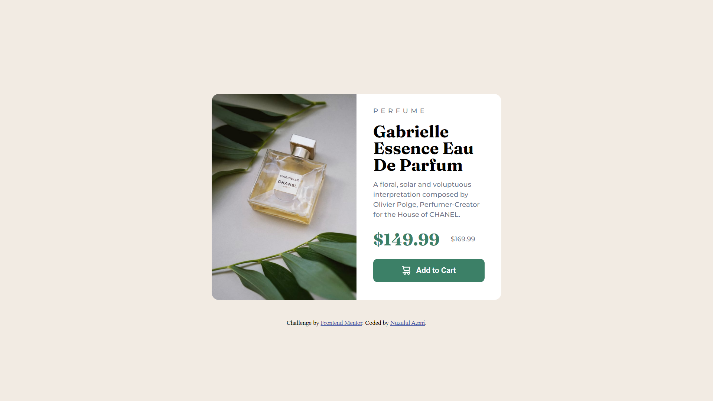

# Frontend Mentor - Product preview card component solution

This is a solution to the [Product preview card component challenge on Frontend Mentor](https://www.frontendmentor.io/challenges/product-preview-card-component-GO7UmttRfa). Frontend Mentor challenges help you improve your coding skills by building realistic projects. 

## Table of contents

- [Overview](#overview)
  - [The challenge](#the-challenge)
  - [Screenshot](#screenshot)
  - [Links](#links)
- [My process](#my-process)
  - [Built with](#built-with)
  - [What I learned](#what-i-learned)
  - [Continued development](#continued-development)
  - [Useful resources](#useful-resources)
- [Author](#author)
- [Acknowledgments](#acknowledgments)

## Overview

### The challenge

Users should be able to:

- View the optimal layout depending on their device's screen size
- See hover and focus states for interactive elements

### Screenshot



### Links

- Solution URL: (https://www.frontendmentor.io/profile/nuzulazmi/solutions)
- Live Site URL: (https://nuzulazmi.github.io/product-preview-card/)

## My process

### Built with

- Semantic HTML5 markup
- CSS custom properties
- Flexbox
- Media Queries

### What I learned

I've learned several ways to use Flex properties in CSS, and I'm implementing them in this project, I only use one property in this project.
This is an example of CSS Flex I just learned:

-CSS
```
.example {
align-self: center;
}
```
Note: property "Align-self" will only work if the parent element is given the property "display: flex;".
The "align-self" property has several values ​​including: "flex-start, flex-end, baseline, stretch, auto"

### Continued development

-No Update

### Useful resources

Note: I actually don't use any resources from anywhere for this project, but I want to give one of the resources I usually use. 
Here it is:

- [Example resource 1](https://fontawesome.com/icons) - Fontawesome is one of the popular resources that many developers use. I really like fontawesome, because they have interesting and cool icons.

## Author

- Website - []() - 
- Frontend Mentor - [@nuzulazmi](https://www.frontendmentor.io/profile/nuzulazmi)
- Twitter - [Nuzulul Azmi](https://twitter.com/Nuzuelazmy)
- LinkedIn - [Nuzulul Azmi](https://www.linkedin.com/in/nuzuel-azmy-392490246/)
- Github - [Nuzulul Azmi](https://github.com/nuzulazmi)
- W3Schools - [Nuzulul Azmi](https://www.w3profile.com/Nuzulul_Azmi)
- StackOverflow - [nuzulul-azmi](https://stackoverflow.com/users/20308624/nuzulul-azmi)
- FreeCodeCamp - [Nuzulul Azmi](https://www.freecodecamp.org/fccb299c7c7-1716-4665-9d41-3b6ea74a4eed)

## Acknowledgments

Because I am working on this project myself, therefore I want to thank me for completing this project.
And thank you for stopping by.Have a nice day!...
